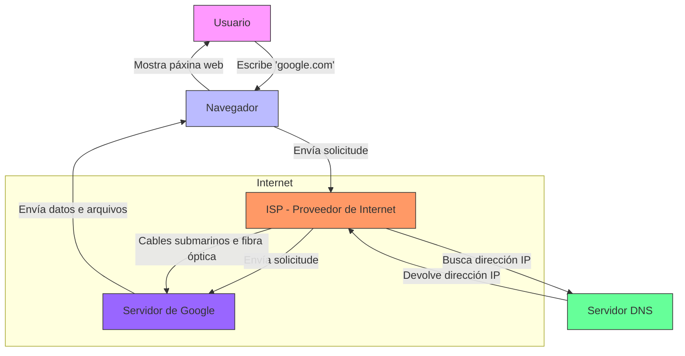
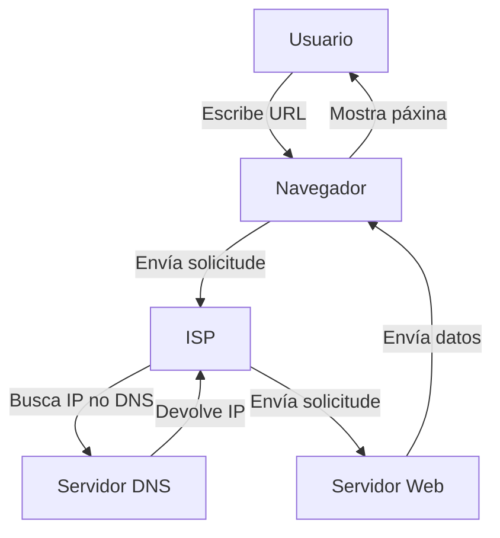

# Como funciona Internet

Vou a intentar explicar de forma clara e sinxela como funciona Internet. 

---

### **Que é Internet?**

Aínda hai quen pensa que Internet é unha "nube" que flota no ceo, ou que funciona dun xeito parecido a como o facía a televisión con ondas que viaxaban polo aire. Para outros é simplemente algo moi complexo e difícil de entender. A realidade é moito máis sinxela. **Internet é, basicamente, un conxunto de cables que conectan ordenadores en todo o mundo.** 

Imaxina un cable enorme que une un ordenador en Santiago con outro en Berlín. Eses ordenadores poden comunicarse e transferir datos a través dese cable. Agora, imaxina que ese cable se estende por todo o planeta, conectando millóns de ordenadores. Iso é Internet.

---

### **Ordenadores conectados: servidores e clientes**

Algúns destes ordenadores teñen un traballo especial: **están conectados 24 horas ao día, listos para servir datos e arquivos cando os solicitas.** Estes ordenadores chámanse **servidores**. 

- **Servidores**: Son como bibliotecas xigantes que almacenan toda a información dos sitios web. Cando intentas acceder a un sitio web, o servidor envía os arquivos e datos necesarios para que poidas ver esa páxina.
- **Clientes**: Calquera ordenador que uses para acceder a Internet (o teu portátil, móbil, etc.) é un **cliente**. O cliente solicita información ao servidor, e o servidor responde enviando os datos.

---

### **Como se atopan os sitios web?**

Se estás na túa casa e escribes "google.com" no teu navegador, o que ocorre é o seguinte:

1. **O teu navegador envía unha solicitude ao teu ISP (Proveedor de Servizos de Internet)**, como AT&T, Comcast, ou BT no Reino Unido.
2. **O ISP envía esa solicitude a un servidor DNS (Sistema de Nomes de Dominio)**. O DNS é como unha "guía telefónica" de Internet. Busca a **dirección IP** do sitio web que solicitaches.
   - **Dirección IP**: É como un "código postal" para cada ordenador en Internet. Permite localizar e contactar con calquera dispositivo conectado.
3. **O servidor DNS devolve a dirección IP ao teu navegador**, que entón fai unha solicitude directa a esa dirección IP.
4. **Os servidores de Google (ou calquera outro sitio web) envían os arquivos e datos necesarios** para que poidas ver a páxina web.

---

### **Cables submarinos: a conexión global**

Pero, ¿como se conectan todos estes ordenadores ao redor do mundo? A resposta está nos **cables submarinos**. 

- **Cables submarinos**: Son cables enormes que cruzan os océanos, conectando continentes. Están feitos de centos de fibras ópticas que transmiten datos a velocidades de ata **400 gigabytes por segundo**.
- **Mapa de cables submarinos**: Podes ver como están distribuídos estes cables en sitios como [submarinecablemap.com](https://www.submarinecablemap.com). É unha marabilla da tecnoloxía moderna.

---

### **Resumo: como funciona Internet**

1. **Internet é unha rede de cables** que conecta ordenadores en todo o mundo.
2. **Os servidores almacenan e serven datos** cando os solicitas.
3. **Os DNS actúan como guías**, convertendo nomes de dominio (como "google.com") en direccións IP.
4. **Os cables submarinos permiten a conexión global**, transmitindo datos a velocidades incribles.

---

##### **Explicación do esquema**:

1. **Usuario**: O usuario escribe "google.com" no navegador.
2. **Navegador**: O navegador envía unha solicitude ao ISP (Proveedor de Servizos de Internet).
3. **ISP**: O ISP busca a dirección IP do sitio web (google.com) no servidor DNS.
4. **Servidor DNS**: O DNS actúa como unha "guía telefónica" e devolve a dirección IP ao ISP.
5. **Servidor de Google**: O ISP envía a solicitude ao servidor de Google usando a dirección IP. O servidor de Google envía os datos e arquivos necesarios ao navegador.
6. **Navegador**: O navegador recibe os datos e mostra a páxina web ao usuario.

---

### **Proba isto!**

Podes buscar a dirección IP de calquera sitio web. Por exemplo, escribe "google.com" en [ipinfo.io](https://ipinfo.io) e verás a dirección IP dos servidores de Google. Se copias e pegas esa dirección IP no teu navegador, accederás directamente á páxina de Google.

---

### **Conclusión**

Internet non é máis que unha rede de cables e ordenadores que traballan xuntos para enviar e recibir datos. Grazas a esta infraestrutura, podemos acceder a sitios web, enviar correos electrónicos, ver vídeos e moito máis. E todo isto ocorre en cuestión de milisegundos, grazas a tecnoloxías avanzadas como as fibras ópticas e os servidores DNS.

---

### **Como se relaciona isto co desenvolvemento web?**

Para crear sitios web e aplicacións, é esencial entender como funciona Internet. Saber como os datos viaxan desde os servidores ata os clientes axudarate a construír aplicacións máis eficientes e a solucionar problemas cando algo non funciona.

---

### **Enlaces de interese**:

1. **Mapa de cables submarinos**: [Submarine Cable Map](https://www.submarinecablemap.com)
2. **Buscar direccións IP**: [IPinfo](https://ipinfo.io)
3. **Máis sobre DNS**: [Cloudflare - ¿Qué é DNS?](https://www.cloudflare.com/es-es/learning/dns/what-is-dns/)
4. **Como funcionan os servidores web**: [MDN Web Docs - Como funciona a web](https://developer.mozilla.org/es/docs/Learn/Common_questions/How_does_the_Internet_work)

---
DAW🧊2025