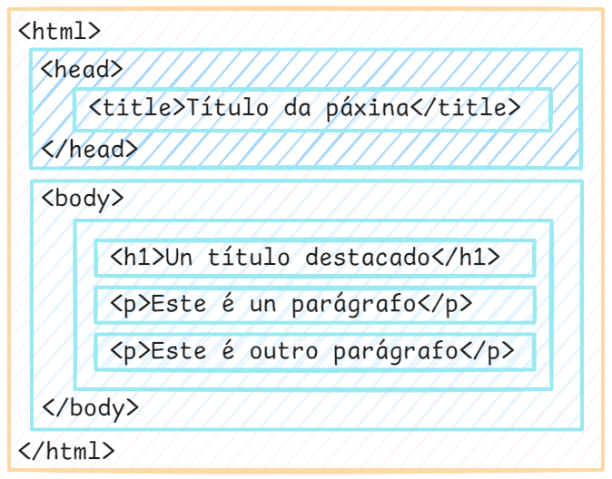

Claro! Vou traducir e completar o texto ao galego:

---

### **Que é HTML?**
- HTML significa **Hyper Text Markup Language** (Linguaxe de Marcado de Hipertexto).
- HTML é a **linguaxe de marcado estándar** para crear páxinas web.
- HTML describe a **estrutura dunha páxina web**.
- HTML está formado por unha serie de **etiquetas** ou **elementos**.
- As etiquetas ou elementos de HTML **indican ao navegador como amosar o contido**.
- As etiquetas ou elementos de HTML **etiquetan partes do contido**, como "isto é un título", "isto é un parágrafo", "isto é unha ligazón", etc.

---

### **Exemplos de etiquetas HTML:**
- `<h1>` a `<h6>`: Definen títulos ou cabeceiras, onde `<h1>` é o máis importante e `<h6>` o menos importante.
- `<p>`: Define un parágrafo.
- `<a>`: Define unha ligazón (hipervínculo).
- ``: Insire unha imaxe.
- `<ul>` e `<ol>`: Definen listas non ordenadas e ordenadas, respectivamente.
- `<li>`: Define un elemento dunha lista.

---

### **Como funciona HTML?**
Cando escribes código HTML, estás a crear unha estrutura que o navegador web interpreta para amosar o contido de forma visual. Por exemplo:

```html
<!DOCTYPE html>
<html lang="gl">
<head>
    <meta charset="UTF-8">
    <title>Exemplo HTML</title>
</head>
<body>
    <h1>Benvido á miña páxina web</h1>
    <p>Esta é unha páxina de exemplo.</p>
    <a href="https://exemplo.com">Visita este sitio</a>
</body>
</html>
```

Neste exemplo:
- A declaración ``<!DOCTYPE html>`` define que este documento é un documento HTML5.
- A etiqueta `<html>` é a etiqueta raíz dunha páxina HTML. As últimas versións dos navegadores recomendan o uso do atributo `lang` para especificar a linguaxe local na que está escrito o contido, ex.g. `gl` &rarr; galego.
- A etiqueta `<head>` é a etiqueta que aniña ou contén metainformación sobre a páxina HTML actual. A información contida nesta sección vai dirixida a navegadores e indexadores de contido entre outros. Aquí atopamos datos de interese para o SEO, o posicionamento e a responsividade. Entre outras, aquí atopamos:
  - A etiqueta `<title` que especifica un título para a páxina HTML (que é o que aparece na barra de título do navegador ou na pestana da páxina). 
- A etiqueta `<body>`  define o corpo do documento e é un contedor para todos os contidos visibles, como títulos, parágrafos, imaxes, hiperenlaces, táboas, listas, etc. Aquí atoparás as etiquetas para o marcado do teu contido, entre outras:
  - `<h1`: etiqueta que define o título de maior tamaño e|ou xerarquía.
  - `<p>`: etiqueta que define un parágrafo.
  - …
  
  

---

### **Por que é importante HTML?**
- HTML é a **base de todas as páxinas web**.
- Sen HTML, os navegadores non poderían interpretar e amosar o contido dunha páxina.
- É a primeira linguaxe que se aprende no desenvolvemento web e é esencial para crear sitios web estáticos e dinámicos.

---

### **Enlaces de interese**
- [Documentación oficial de HTML (MDN Web Docs)](https://developer.mozilla.org/es/docs/Web/HTML)
- [W3Schools: Tutorial de HTML](https://www.w3schools.com/html/)

---

### :tada:

DAW 2025