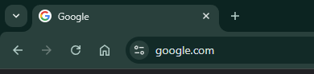

# Formatado

## Etiquetas ou elementos HTML

**Que é unha etiqueta (*tag*)/elemento HTML?**

Unha etiqueta (*tag*) ou elemento HTML é calquera marcado empregado no documento HTML, dende a etiqueta de inicio ata a etiqueta de remate.

``<etiqueta> O contido vai aquí... </etiqueta>``

Exemplos de etiquetas son `<h1` ou `<p>`:
``<h1>Un titular</h1>``
``<p>E isto é un parágrafo.</p>``

O máis común é que un elemento teña unha etiqueta de apertura e outra de peche, mentres o contido a marcar queda entre ámbalas dúas.

| Etiqueta de apertura |  Contido do elemento  | Etiqueta de peche |
| -------------------- | :-------------------: | ----------------: |
| `<h1>`               |      Un titular       |           `</h1>` |
| `<p>`                | E isto é un parágrafo |            `</p>` |
| `<br>`               |      (*non ten*)      |       (*non ten*) |

Algunhas etiquetas HTML non teñen contido (como a etiqueta ``<br>`` ou `<hr>`). Estas etiquetas chámanse etiquetas ou elementos baleiros ou de autopeche. As etiquetas baleiras non precisan unha etiqueta de finalización.

### **Aniñado de etiquetas**

As etiquetas HTML pódense aniñar. Isto significa que as etiquetas poden conter outras etiquetas.
Todos os documentos HTML se compoñen de etiquetas HTML aniñadas, unhas noutras.
O seguinte exemplo contén oito etiquetas HTML:

```html
<!DOCTYPE html>
<html lang="gl">
<head>
    <meta charset="UTF-8">
    <title>Exemplo HTML</title>
</head>
<body>
    <h1>Benvido á miña páxina web</h1>
    <p>Esta é unha páxina de exemplo.</p>
    <a href="https://exemplo.com">Visita este sitio</a>
</body>
</html>
```

As oito etiquetas son: `<html>`, `<head>`, `<title>`, `<body>`, `<h1>`, `<p>` e `<a>`.

## Atributos HTML

Os atributos modifican ou completan ás etiquetas.

- Todas as etiquetas HTML poden ter atributos
- Os atributos proporcionan información adicional sobre os elementos
- Os atributos sempre se especifican na etiqueta de inicio
- Os atributos adoitan vir en pares nome/valor como: ``nome="valor"``

### **O atributo ``lang``**

- Sempre debe incluír o atributo ``lang`` dentro da etiqueta `html`, para declarar o idioma da páxina web. Isto está destinado a axudar aos motores de busca e navegadores a indexar correctamente os contidos.

## **Favicon**

Un **favicon** é unha pequena imaxe que se mostra ao carón do título da páxina na lapela do navegador.
Simplemente se debe engadir a seguinte etiqueta aniñada na cabeceira do documento:
`<link rel="icon" type="image/x-icon" href="favicon.ico”>`
Para engadir un favicon ao teu sitio web, garda a imaxe que vas a usar como favicon na raíz do proxecto ou no directorio de imaxes. Un nome común para imaxe do favicon é `favicon.ico`. Pero tamén `favicon.png` ou  `favicon.svg`.



## Elementos

### Titulares (*headings*: ``h1``/``h6``)

Os **headings** (cabeceiras ou encabezados) en HTML son etiquetas que se usan para definir títulos e subtítulos nunha páxina web. Estas etiquetas son fundamentais para estruturar o contido e mellorar a accesibilidade e o SEO (optimización para motores de busca). Vou explicar para que serven e como se usan:

---

#### **1. Etiquetas de heading**
HTML ofrece seis niveis de cabeceiras, desde `<h1>` ata `<h6>`. Cada unha representa un nivel de importancia, sendo `<h1>` o máis importante e `<h6>` o menos importante.

- **`<h1>`**: Úsase para o título principal da páxina. Debe haber só un `<h1>` por páxina.
- **`<h2>` a `<h6>`**: Úsanse para subtítulos e seccións secundarias. Podes ter varios destes en función da estrutura do teu contido.

Exemplo:

```html
<h1>Benvido á miña páxina web</h1>
<h2>Sobre min</h2>
<p>Aquí tes algunha información sobre min.</p>
<h3>Os meus proxectos</h3>
<p>Descrición dos meus proxectos.</p>
<h4>Detalles técnicos</h4>
<p>Máis información técnica.</p>
```

---

#### **2. Para que serven os headings?**
Os headings cumpren varias funcións importantes:

##### **a) Estruturar o contido**
- Axudan a organizar o contido dunha páxina en seccións e subseccións.
- Fan máis fácil a lectura e comprensión do contido para os usuarios.

##### **b) Accesibilidade**
- As cabeceiras son usadas polos lectores de pantalla (para persoas con discapacidade visual) para navegar polo contido dunha páxina.
- Unha estrutura de cabeceiras correcta mellora a experiencia de usuarios con necesidades especiais.

##### **c) SEO (Optimización para motores de busca)**
- Os motores de busca como Google usan as cabeceiras para entender a estrutura e a importancia do contido dunha páxina.
- Un uso axeitado das etiquetas `<h1>` a `<h6>` pode mellorar o posicionamento da túa páxina nos resultados de busca.

##### **d) Estilo visual**
- Por defecto, os navegadores aplican estilos diferentes a cada cabeceira (`<h1>` é máis grande e en negrita, `<h6>` é máis pequeno).
- Podes personalizar estes estilos usando CSS.

---

#### **3. Boas prácticas**
- **Usa só un `<h1>` por páxina**: Este debe ser o título principal.
- **Mantén unha xerarquía lóxica**: Non saltes niveis de cabeceiras (por exemplo, non uses `<h3>` directamente despois de `<h1>`).
- **Usa as cabeceiras para organizar o contido**: Non as uses só para cambiar o tamaño do texto. Para iso, usa CSS.
- **Sé consistente**: Mantén unha estrutura de cabeceiras coherente en todo o teu sitio web.

---

#### **4. Exemplo de estrutura correcta**
```html
<h1>O meu blog persoal</h1>
<h2>Últimas publicacións</h2>
<h3>Como aprender HTML</h3>
<p>Guía práctica para aprender HTML.</p>
<h3>Usando CSS</h3>
<p>Algúns trucos útiles para CSS.</p>
<h2>Sobre min</h2>
<p>Un pouco sobre a miña traxectoria.</p>
```

---

#### **5. Como personalizar os headings con CSS**
Podes cambiar o estilo das cabeceiras usando CSS. Por exemplo:

```css
h1 {
  font-size: 2.5rem;
  color: #333;
}

h2 {
  font-size: 2rem;
  color: #555;
}

h3 {
  font-size: 1.75rem;
  color: #777;
}
```

---

#### **6. Resumo**
- **`<h1>`**: Título principal (único por páxina).
- **`<h2>` a `<h6>`**: Subtítulos e seccións secundarias.
- **Importancia**: Axudan a estruturar o contido, mellorar a accesibilidade e optimizar o SEO.
- **Boas prácticas**: Usa unha xerarquía lóxica e sé consistente.

---

### Parágrafos

Os **parágrafos** en HTML, representados pola etiqueta `<p>`, son un dos elementos máis básicos e importantes para estruturar o contido textual dunha páxina web. Vou explicar para que serven, como se usan e que elementos se adoitan incluír dentro deles.

---

#### **1. Para que serven os parágrafos `<p>`?**
A etiqueta `<p>` úsase para definir un bloque de texto como un parágrafo. Os parágrafos son fundamentais para:

- **Organizar o contido**: Separan o texto en bloques lóxicos, facilitando a lectura e comprensión.
- **Mellorar a accesibilidade**: Os lectores de pantalla e outras ferramentas de accesibilidade usan os parágrafos para navegar polo contido.
- **Aplicar estilos**: Permiten aplicar CSS de forma específica a cada bloque de texto.

---

#### **2. Como se usan os parágrafos?**
A etiqueta `<p>` é unha etiqueta de bloque, o que significa que crea un novo bloque de contido e engade un espazo antes e despois do texto. Aquí tes un exemplo básico:

```html
<p>Este é un parágrafo de exemplo. Podes escribir aquí o teu texto.</p>
<p>Este é outro parágrafo. Cada parágrafo aparece nunha liña nova.</p>
```

---

#### **3. Elementos que se adoitan usar dentro dos parágrafos**
Dentro dun parágrafo, podes incluír varios elementos HTML para formatear ou engadir funcionalidades ao texto. Aquí tes algúns dos máis comúns:

##### **a) Elementos de formato de texto**
- **`<strong>`**: Para texto en **negrita** (semánticamente importante).
  ```html
  <p>Este é un texto <strong>importante</strong>.</p>
  ```
- **`<em>`**: Para texto en *cursiva* (énfase semántica).
  ```html
  <p>Este é un texto con <em>énfase</em>.</p>
  ```
- **`<u>`**: Para texto subliñado (non se recomenda para semántica, só para estilo visual).
  ```html
  <p>Este é un texto <u>subliñado</u>.</p>
  ```
- **`<s>`**: Para texto ~~tachado~~.
  ```html
  <p>Este é un texto <s>tachado</s>.</p>
  ```

##### **b) Ligazóns**
- **`<a>`**: Para engadir ligazóns (hipervínculos).
  ```html
  <p>Visita o meu <a href="https://exemplo.com">sitio web</a>.</p>
  ```

##### **c) Imaxes**
- **``**: Para inserir imaxes dentro dun parágrafo.
  ```html
  <p>Aquí tes unha imaxe: </p>
  ```

##### **d) Saltos de liña**
- **`<br>`**: Para engadir un salto de liña dentro dun parágrafo.
  ```html
  <p>Este é un parágrafo con un salto de liña.<br>Aquí continúa o texto.</p>
  ```

##### **e) Citas**
- **`<q>`**: Para citas curtas.
  ```html
  <p>Como dixo alguén: <q>Ser ou non ser, esa é a cuestión.</q></p>
  ```

##### **f) Código**
- **`<code>`**: Para mostrar fragmentos de código.
  ```html
  <p>Para imprimir en JavaScript, usa <code>console.log()</code>.</p>
  ```

##### **g) Subíndices e superíndices**
- **`<sub>`**: Para texto en subíndice (por exemplo, fórmulas químicas).
  ```html
  <p>A fórmula da auga é H<sub>2</sub>O.</p>
  ```
- **`<sup>`**: Para texto en superíndice (por exemplo, exponentes matemáticos).
  ```html
  <p>O teorema de Pitágoras é a<sup>2</sup> + b<sup>2</sup> = c<sup>2</sup>.</p>
  ```

---

#### **4. Exemplo completo**
Aquí tes un exemplo que combina varios elementos dentro de parágrafos:

```html
<p>Este é un parágrafo con <strong>texto en negrita</strong>, <em>texto en cursiva</em> e unha <a href="https://exemplo.com">ligazón</a>.</p>
<p>Aquí tes unha imaxe: </p>
<p>Unha cita famosa: <q>A persistencia é o camiño do éxito.</q></p>
<p>Para imprimir en JavaScript, usa <code>console.log()</code>.</p>
<p>Fórmula química: H<sub>2</sub>O.</p>
<p>Ecuación matemática: x<sup>2</sup> + y<sup>2</sup> = z<sup>2</sup>.</p>
```

---

#### **5. Boas prácticas**
- **Non abuses dos saltos de liña `<br>`**: Se necesitas moitos saltos de liña, é mellor usar varios parágrafos.
- **Usa CSS para estilos**: Evita usar etiquetas como `<u>` ou `<s>` para estilos visuais; en vez diso, usa CSS.
- **Mantén o contido semántico**: Usa `<strong>` e `<em>` para dar importancia semántica, non só para cambiar o estilo visual.

---

#### **6. Resumo**
- **`<p>`**: Úsase para crear parágrafos e organizar o contido textual.
- **Elementos comúns dentro de `<p>`**: `<strong>`, `<em>`, `<a>`, ``, `<br>`, `<q>`, `<code>`, `<sub>`, `<sup>`, etc.
- **Importancia**: Melloran a estrutura, accesibilidade e estilo do contido.

### Etiquetas de formatado

Podes usar a etiqueta `<p` de xeito independente pero se queres mellorar a semántica do teu documento ademais de facer unha presentación de contidos de calidade tamén a podes usar en combinación con outra etiquetas de formatado.

En **HTML5**, hai varias etiquetas de **formatado** que se usan para dar estilo semántico e visual ao texto. Estas etiquetas axudan a estruturar o contido e a mellorar a accesibilidade e a legibilidade. Aquí tes unha lista das principais etiquetas de formatado en HTML5:

---

#### **1. Etiquetas de formato de texto**
Estas etiquetas úsanse para aplicar estilos básicos ao texto.

##### **a) `<strong>`**
- **Uso**: Indica que o texto é importante ou ten un forte énfase.
- **Visual**: O navegador amosa o texto en **negrita**.
- **Exemplo**:
  ```html
  <p>Este é un texto <strong>importante</strong>.</p>
  ```

##### **b) `<em>`**
- **Uso**: Indica énfase no texto.
- **Visual**: O navegador amosa o texto en *cursiva*.
- **Exemplo**:
  ```html
  <p>Este é un texto con <em>énfase</em>.</p>
  ```

##### **c) `<u>`**
- **Uso**: Subliña o texto.
- **Nota**: Non se recomenda para semántica, só para estilo visual.
- **Exemplo**:
  ```html
  <p>Este é un texto <u>subliñado</u>.</p>
  ```

##### **d) `<s>`**
- **Uso**: Indica que o texto está tachado ou xa non é relevante.
- **Visual**: O navegador amosa o texto ~~tachado~~.
- **Exemplo**:
  ```html
  <p>Este é un texto <s>tachado</s>.</p>
  ```

##### **e) `<mark>`**
- **Uso**: Resalta o texto como se fose con marcador.
- **Visual**: O navegador amosa o texto con fondo amarelo.
- **Exemplo**:
  ```html
  <p>Este é un texto <mark>resaltado</mark>.</p>
  ```

##### **f) `<small>`**
- **Uso**: Indica texto secundario ou menos importante.
- **Visual**: O navegador amosa o texto nun tamaño máis pequeno.
- **Exemplo**:
  ```html
  <p>Este é un texto <small>secundario</small>.</p>
  ```

---

#### **2. Etiquetas para citas e referencias**
Estas etiquetas úsanse para citar texto ou referencias.

##### **a) `<q>`**
- **Uso**: Indica unha cita curta.
- **Visual**: O navegador engade comiñas ao redor do texto.
- **Exemplo**:
  ```html
  <p>Como dixo alguén: <q>Ser ou non ser, esa é a cuestión.</q></p>
  ```

##### **b) `<blockquote>`**
- **Uso**: Indica unha cita longa ou un bloque de texto citado.
- **Visual**: O navegador indenta o texto.
- **Exemplo**:
  ```html
  <blockquote>
    Esta é unha cita longa que ocupa varias liñas.
  </blockquote>
  ```

##### **c) `<cite>`**
- **Uso**: Indica o título dunha obra ou referencia.
- **Visual**: O navegador amosa o texto en cursiva.
- **Exemplo**:
  ```html
  <p>Segundo <cite>Shakespeare</cite>, ser ou non ser é a cuestión.</p>
  ```

---

#### **3. Etiquetas para código e texto técnico**
Estas etiquetas úsanse para mostrar código ou texto técnico.

##### **a) `<code>`**
- **Uso**: Indica un fragmento de código.
- **Visual**: O navegador amosa o texto nunha fonte monoespaciada.
- **Exemplo**:
  ```html
  <p>Para imprimir en JavaScript, usa <code>console.log()</code>.</p>
  ```

##### **b) `<pre>`**
- **Uso**: Indica texto preformatado (conserva os espazos e saltos de liña).
- **Visual**: O navegador amosa o texto tal e como está escrito.
- **Exemplo**:
  ```html
  <pre>
    function helloWorld() {
      console.log("Ola Mundo!");
    }
  </pre>
  ```

##### **c) `<kbd>`**
- **Uso**: Indica texto que representa unha entrada do teclado.
- **Visual**: O navegador amosa o texto nunha fonte monoespaciada.
- **Exemplo**:
  ```html
  <p>Preme <kbd>Ctrl + S</kbd> para gardar.</p>
  ```

##### **d) `<samp>`**
- **Uso**: Indica texto que representa a saída dun programa.
- **Visual**: O navegador amosa o texto nunha fonte monoespaciada.
- **Exemplo**:
  ```html
  <p>A saída do programa é: <samp>Ola Mundo!</samp></p>
  ```

---

#### **4. Etiquetas para subíndices e superíndices**
Estas etiquetas úsanse para representar fórmulas matemáticas ou científicas.

##### **a) `<sub>`**
- **Uso**: Indica texto en subíndice.
- **Exemplo**:
  ```html
  <p>A fórmula da auga é H<sub>2</sub>O.</p>
  ```

##### **b) `<sup>`**
- **Uso**: Indica texto en superíndice.
- **Exemplo**:
  ```html
  <p>O teorema de Pitágoras é a<sup>2</sup> + b<sup>2</sup> = c<sup>2</sup>.</p>
  ```

---

#### **5. Etiquetas para texto en liña**
Estas etiquetas úsanse para modificar o comportamento ou estilo do texto en liña.

##### **a) `<span>`**
- **Uso**: Úsase para aplicar estilos ou scripts a unha parte do texto.
- **Exemplo**:
  ```html
  <p>Este é un texto con <span style="color: red;">color vermello</span>.</p>
  ```

##### **b) `<abbr>`**
- **Uso**: Indica unha abreviatura ou acrónimo.
- **Exemplo**:
  ```html
  <p>O <abbr title="World Wide Web">WWW</abbr> é fundamental para Internet.</p>
  ```

##### **c) `<time>`**
- **Uso**: Indica unha data ou hora.
- **Exemplo**:
  ```html
  <p>Hoxe é <time datetime="2023-10-05">5 de outubro de 2023</time>.</p>
  ```

---

#### **6. Resumo**
- **Etiquetas de formato**: `<strong>`, `<em>`, `<u>`, `<s>`, `<mark>`, `<small>`.
- **Citas e referencias**: `<q>`, `<blockquote>`, `<cite>`.
- **Código e texto técnico**: `<code>`, `<pre>`, `<kbd>`, `<samp>`.
- **Subíndices e superíndices**: `<sub>`, `<sup>`.
- **Texto en liña**: `<span>`, `<abbr>`, `<time>`.

Todas elas son etiquetas fundamentais para dar formato semántico e visual ao teu contido HTML. 

### Aclaracións semánticas

A elección entre etiquetas como `<del>` ou `<s>`, `<i>` ou `<em>`, e `<b>` ou `<strong>` depende do **significado semántico** que queiras transmitir, non só do estilo visual. Aquí tes unha explicación detallada de cada unha e cando usar cada unha delas:

---

#### **1. `<del>` vs `<s>`**

##### **`<del>`**
- **Uso**: Indica que un texto foi **eliminado** ou xa non é válido.
- **Semántica**: Úsase cando queres mostrar que un texto foi eliminado dun documento ou xa non é relevante.
- **Visual**: O navegador amosa o texto ~~tachado~~.
- **Exemplo**:
  ```html
  <p>O prezo orixinal era <del>100€</del>, agora é 80€.</p>
  ```

##### **`<s>`**
- **Uso**: Indica que un texto xa non é correcto ou está **obsoleto**.
- **Semántica**: Úsase cando o texto xa non é relevante, pero non necesariamente foi eliminado.
- **Visual**: O navegador amosa o texto ~~tachado~~.
- **Exemplo**:
  ```html
  <p>O evento foi <s>cancelado</s>.</p>
  ```

##### **¿Cando usar cada unha?**
- Usa `<del>` cando o texto foi eliminado ou substituído por outro.
- Usa `<s>` cando o texto xa non é correcto ou está obsoleto, pero non foi eliminado explicitamente.

---

#### **2. `<i>` vs `<em>`**

##### **`<i>`**
- **Uso**: Indica texto en **cursiva** sen un significado semántico específico.
- **Semántica**: Úsase para texto que necesita unha diferenciación visual, como termos técnicos, frases noutro idioma ou pensamentos.
- **Visual**: O navegador amosa o texto en *cursiva*.
- **Exemplo**:
  ```html
  <p>O termo <i>quantum</i> vén do latín.</p>
  ```

##### **`<em>`**
- **Uso**: Indica **énfase** no texto.
- **Semántica**: Úsase cando queres destacar unha palabra ou frase como importante.
- **Visual**: O navegador amosa o texto en *cursiva*.
- **Exemplo**:
  ```html
  <p>Debes <em>sempre</em> facer copias de seguridade.</p>
  ```

##### **¿Cando usar cada unha?**
- Usa `<i>` para texto que necesita cursiva sen un significado especial (por exemplo, termos técnicos ou frases noutro idioma).
- Usa `<em>` para texto que require énfase semántica.

---

#### **3. `<b>` vs `<strong>`**

##### **`<b>`**
- **Uso**: Indica texto en **negrita** sen un significado semántico específico.
- **Semántica**: Úsase para texto que necesita unha diferenciación visual, como palabras clave ou títulos.
- **Visual**: O navegador amosa o texto en **negrita**.
- **Exemplo**:
  ```html
  <p>O <b>HTML</b> é a base do desenvolvemento web.</p>
  ```

##### **`<strong>`**
- **Uso**: Indica que o texto é **importante** ou ten un forte énfase.
- **Semántica**: Úsase cando queres destacar unha palabra ou frase como importante.
- **Visual**: O navegador amosa o texto en **negrita**.
- **Exemplo**:
  ```html
  <p>Debes <strong>nunca</strong> compartir os teus contrasinais.</p>
  ```

##### **¿Cando usar cada unha?**
- Usa `<b>` para texto que necesita negrita sen un significado especial (por exemplo, palabras clave ou títulos).
- Usa `<strong>` para texto que require énfase semántica.

---

#### **4. Para que se usa `<ins>`?**

##### **`<ins>`**
- **Uso**: Indica que un texto foi **engadido** ou inserido nun documento.
- **Semántica**: Úsase cando queres mostrar que un texto foi engadido recentemente ou modificado.
- **Visual**: O navegador amosa o texto subliñado.
- **Exemplo**:
  ```html
  <p>O prezo orixinal era 100€, agora é <ins>80€</ins>.</p>
  ```

##### **Combinación con `<del>`**
- `<ins>` e `<del>` úsanse xuntos para mostrar cambios nun documento.
- **Exemplo**:
  ```html
  <p>O prezo orixinal era <del>100€</del>, agora é <ins>80€</ins>.</p>
  ```

---

#### **Resumo**
- **`<del>` vs `<s>`**:
  - `<del>`: Texto eliminado ou substituído.
  - `<s>`: Texto obsoleto ou xa non correcto.
- **`<i>` vs `<em>`**:
  - `<i>`: Cursiva para diferenciación visual.
  - `<em>`: Énfase semántica.
- **`<b>` vs `<strong>`**:
  - `<b>`: Negrita para diferenciación visual.
  - `<strong>`: Importancia semántica.
- **`<ins>`**: Texto engadido ou inserido.

---

### Outras etiquetas de formatado

Vexamos en detalle algunhas outras etiquetas e atributos, e vexamos que potencial uso podemos darlle

---

#### **1. Etiqueta `<blockquote>`**
A etiqueta `<blockquote>` úsase para citar un bloque de texto longo doutra fonte. É ideal para citas extensas que requiren unha indentación ou un formato especial.

##### **Características**:
- **Visual**: O navegador indenta o texto para diferencialo do resto do contido.
- **Atributo `cite`**: Pódese usar para indicar a URL ou fonte da cita.

##### **Exemplo**:
```html
<blockquote cite="https://exemplo.com/fonte">
  Esta é unha cita longa que ocupa varias liñas. O texto está indentado para destacalo do resto do contido.
</blockquote>
```

---

#### **2. Atributo `cite`**
O atributo `cite` úsase en etiquetas como `<blockquote>` ou `<q>` para indicar a fonte da cita. Non é visible no navegador, pero é útil para a accesibilidade e os motores de busca.

##### **Exemplo**:
```html
<blockquote cite="https://exemplo.com/fonte">
  Esta é unha cita longa.
</blockquote>
```

---

#### **3. Etiqueta `<cite>`**
A etiqueta `<cite>` úsase para referenciar o título dunha obra, como un libro, artigo, película, etc. Normalmente, o navegador amosa o texto en *cursiva*.

##### **Exemplo**:
```html
<p>Segundo <cite>Shakespeare</cite>, ser ou non ser é a cuestión.</p>
```

---

#### **4. Atributo `title`**
O atributo `title` úsase para proporcionar información adicional sobre un elemento. Cando o usuario pasa o rato por riba do elemento, amósase unha pequena descrición ou tooltip.

##### **Exemplo**:
```html
<p>Este é un texto con un <abbr title="HyperText Markup Language">HTML</abbr> explicado.</p>
```

---

#### **5. Etiqueta `<address>`**
A etiqueta `<address>` úsase para proporcionar información de contacto, como un enderezo, correo electrónico ou teléfono. Normalmente, o navegador amosa o texto en *cursiva*.

##### **Exemplo**:
```html
<address>
  Escrito por <a href="mailto:exemplo@exemplo.com">Fulano de Tal</a>.<br>
  Visítanos en:<br>
  Rúa Exemplo, 123<br>
  Santiago de Compostela, Galicia
</address>
```

---

#### **6. Outras etiquetas de formatado**

##### **a) `<dfn>`**
- **Uso**: Define un termo ou concepto.
- **Visual**: O navegador amosa o texto en *cursiva*.
- **Exemplo**:
  ```html
  <p>O <dfn>HTML</dfn> é a linguaxe de marcado estándar para crear páxinas web.</p>
  ```

##### **b) `<var>`**
- **Uso**: Indica unha variable ou un valor que pode cambiar.
- **Visual**: O navegador amosa o texto en *cursiva*.
- **Exemplo**:
  ```html
  <p>A variable <var>x</var> representa un número descoñecido.</p>
  ```

##### **c) `<time>`**
- **Uso**: Indica unha data ou hora.
- **Atributo `datetime`**: Proporciona un formato máquina-readable para a data/hora.
- **Exemplo**:
  ```html
  <p>O evento é o <time datetime="2023-12-25">25 de decembro de 2023</time>.</p>
  ```

##### **d) `<meter>`**
- **Uso**: Representa un valor dentro dun rango (por exemplo, unha barra de progreso).
- **Atributos**: `value`, `min`, `max`, `low`, `high`, `optimum`.
- **Exemplo**:
  ```html
  <p>Uso do disco: <meter value="70" min="0" max="100">70%</meter></p>
  ```

##### **e) `<progress>`**
- **Uso**: Representa o progreso dunha tarefa.
- **Atributos**: `value`, `max`.
- **Exemplo**:
  ```html
  <p>Progreso da descarga: <progress value="50" max="100">50%</progress></p>
  ```

##### **f) `<details>` e `<summary>`**
- **Uso**: Crea unha sección despregable (acordeón).
- **Exemplo**:
  ```html
  <details>
    <summary>Máis información</summary>
    <p>Este é o contido adicional que se amosa ao despregar.</p>
  </details>
  ```

---

#### **Resumo**
- **`<blockquote>`**: Para citas longas.
- **Atributo `cite`**: Indica a fonte dunha cita.
- **`<cite>`**: Para referenciar títulos de obras.
- **Atributo `title`**: Proporciona información adicional (tooltip).
- **`<address>`**: Para información de contacto.
- **Outras etiquetas**: `<dfn>`, `<var>`, `<time>`, `<meter>`, `<progress>`, `<details>` e `<summary>`.

### Etiqueta de anulación bidireccional

A etiqueta HTML **`<bdo>`** (que significa **Bidirectional Override**, ou "anulación bidireccional") úsase para cambiar a dirección do texto. É especialmente útil cando se traballa con idiomas que se escriben de dereita a esquerda (RTL, como o árabe ou o hebreo) ou cando se necesita forzar unha dirección de texto específica.

---

#### **1. Que é `<bdo>`?**
A etiqueta `<bdo>` permíteche anular a dirección predeterminada do texto. O texto dentro desta etiqueta amósase na dirección que especifiques, independentemente da dirección predeterminada do idioma ou do contexto.

##### **Atributo `dir`**
O atributo `dir` é obrigatorio e define a dirección do texto:
- **`dir="ltr"`**: O texto amósase de **esquerda a dereita** (Left-to-Right).
- **`dir="rtl"`**: O texto amósase de **dereita a esquerda** (Right-to-Left).

---

#### **2. Exemplos de uso**

##### **Texto de esquerda a dereita (LTR)**
```html
<p>Este texto é normal. <bdo dir="ltr">Este texto tamén é de esquerda a dereita.</bdo></p>
```

##### **Texto de dereita a esquerda (RTL)**
```html
<p>Este texto é normal. <bdo dir="rtl">Este texto é de dereita a esquerda.</bdo></p>
```

##### **Combinación de idiomas**
Se estás a traballar con idiomas mixtos (por exemplo, inglés e árabe), podes usar `<bdo>` para garantir que o texto se amose correctamente:
```html
<p>Texto en inglés: <bdo dir="rtl">هذا نص باللغة العربية</bdo></p>
```

---

#### **3. Implicacións no uso de `<bdo>`**

##### **a) Accesibilidade**
- O uso correcto de `<bdo>` é importante para garantir que o texto se amose correctamente en idiomas RTL.
- Os lectores de pantalla e outras ferramentas de accesibilidade interpretan correctamente a dirección do texto cando se usa `<bdo>`.

##### **b) Compatibilidade**
- `<bdo>` é compatible con todos os navegadores modernos.
- Non afecta ao comportamento do texto fóra da etiqueta, só ao texto dentro dela.

##### **c) Uso con CSS**
Podes combinar `<bdo>` con CSS para controlar aínda máis o estilo do texto:
```html
<bdo dir="rtl" style="color: red; font-weight: bold;">Este texto é de dereita a esquerda e ten estilo CSS.</bdo>
```

---

#### **4. Outras etiquetas relacionadas**
Se estás a traballar con texto bidireccional, tamén podes usar estas etiquetas e atributos:

##### **a) Atributo `dir` global**
Podes aplicar o atributo `dir` a calquera elemento HTML para cambiar a dirección do texto:
```html
<p dir="rtl">Este parágrafo é de dereita a esquerda.</p>
```

##### **b) Etiqueta `<bdi>`**
A etiqueta `<bdi>` (Bidirectional Isolation) úsase para illar unha parte do texto e evitar que a súa dirección afecte ao texto circundante. É útil cando non coñeces a dirección do texto (por exemplo, cando se insire texto dinámico).
```html
<p>Nome de usuario: <bdi>محمد</bdi></p>
```

---

#### **5. Resumo**
- **`<bdo>`**: Úsase para cambiar a dirección do texto (LTR ou RTL).
- **Atributo `dir`**: Define a dirección do texto (`ltr` ou `rtl`).
- **Implicacións**: Importante para idiomas RTL, accesibilidade e compatibilidade.
- **Uso con CSS**: Pódese combinar con estilos CSS para mellorar a presentación.

### Enlaces e ancoras

Claro! Vou explicarche todo sobre os **hiperenlaces en HTML5**, incluíndo enlaces internos, externos, de correo electrónico, saltos de páxina (pagejump), marcadores (bookmarks), atributos de enlace, imaxes con enlaces e mapas de imaxe.

---

#### **1. Hiperenlaces básicos**
Os hiperenlaces créanse coa etiqueta `<a>` e o atributo `href`. O texto ou elemento dentro da etiqueta convértese nun enlace clicable.

##### **Exemplo básico**:
```html
<a href="https://exemplo.com">Visita Exemplo.com</a>
```

---

#### **2. Tipos de enlaces**

##### **a) Enlaces internos**
Dirixen a outras páxinas ou seccións dentro do mesmo sitio web. Usan rutas relativas ou absolutas.

- **Ruta relativa**:
  
  ```html
  <a href="sobre.html">Sobre nós</a>
  ```
- **Ruta absoluta**:
  ```html
  <a href="/proxectos/proxecto1.html">Proxecto 1</a>
  ```

##### **b) Enlaces externos**
Dirixen a páxinas doutros sitios web. Usan URLs completas.

- **Exemplo**:
  ```html
  <a href="https://google.com">Visita Google</a>
  ```

##### **c) Enlaces de correo electrónico**
Permiten enviar un correo electrónico ao enderezo especificado. Úsase o prefixo `mailto:`.

- **Exemplo**:
  ```html
  <a href="mailto:exemplo@exemplo.com">Envíanos un correo</a>
  ```

##### **d) Enlaces de salto de páxina (Pagejump)**
Dirixen a unha sección específica da mesma páxina. Úsase o atributo `id` para identificar a sección. Esta é  unha técnica que se asocia co modelo de desenvolvemento coñecido como 'One-page-site' 

- **Exemplo**:
  ```html
  <a href="#seccion2">Ir á Sección 2</a>
  ...
  <h2 id="seccion2">Sección 2</h2>
  ```

##### **e) Enlaces de marcador (Bookmark)**
Permiten gardar unha posición específica nunha páxina para acceder directamente a ela. Úsase o atributo `id` e unha URL completa.

- **Exemplo**:
  ```html
  <a href="https://exemplo.com#seccion2">Ir á Sección 2 en Exemplo.com</a>
  ```

---

#### **3. Atributos de enlace**

##### **a) `href`**
Especifica a URL ou destino do enlace.

##### **b) `target`**
Define onde se abre o enlace:
- **`_blank`**: Abre o enlace nunha nova pestana ou ventá.
- **`_self`**: Abre o enlace na mesma pestana (predeterminado).
- **`_parent`**: Abre o enlace no marco pai.
- **`_top`**: Abre o enlace no marco superior.

- **Exemplo**:
  ```html
  <a href="https://exemplo.com" target="_blank">Abrir en nova pestana</a>
  ```

##### **c) `rel`**
Especifica a relación entre o documento actual e o documento vinculado. Úsase para SEO e seguridade.
- **`nofollow`**: Indica aos motores de busca que non sigan o enlace.
- **`noopener`**: Evita que o novo documento acceda ao documento orixinal (seguridade).
- **`noreferrer`**: Oculta a información de referencia ao abrir o enlace.

- **Exemplo**:
  ```html
  <a href="https://exemplo.com" rel="nofollow noopener noreferrer">Visita Exemplo.com</a>
  ```

##### **d) `title`**
Proporciona un tooltip ou descrición adicional sobre o enlace.

- **Exemplo**:
  ```html
  <a href="https://exemplo.com" title="Visita Exemplo.com">Exemplo</a>
  ```

---

#### **4. Uso de imaxes con enlaces**
Podes usar unha imaxe como enlace envolvéndoa nunha etiqueta `<a>`.

- **Exemplo**:
  
  ```html
  <a href="https://exemplo.com">
    
  </a>
  ```

---

#### **5. Mapas de imaxe**
Os mapas de imaxe permítenche crear áreas clicables dentro dunha imaxe. Úsanse as etiquetas `<map>` e `<area>`.

##### **Exemplo**:
```html

<map name="mapaexemplo">
  <area shape="rect" coords="0,0,50,50" href="seccion1.html" alt="Sección 1">
  <area shape="circle" coords="100,100,50" href="seccion2.html" alt="Sección 2">
  <area shape="poly" coords="200,200,250,250,300,200" href="seccion3.html" alt="Sección 3">
</map>
```

- **`shape`**: Define a forma da área (`rect`, `circle`, `poly`).
- **`coords`**: Define as coordenadas da área.
- **`href`**: Especifica o destino do enlace.
- **`alt`**: Proporciona un texto alternativo para a área.

**Outro exemplo**:

Imaxina que tes unha imaxe chamada `mapa.png` que representa un mapa simple con tres áreas:

1. Un **rectángulo** na esquina superior esquerda.
2. Un **círculo** no centro.
3. Un **triángulo** na esquina inferior dereita.

Aquí tes o código HTML para crear un mapa de imaxe con esas áreas:

```html

<map name="mapaexemplo">
  <!-- Área rectangular na esquina superior esquerda -->
  <area shape="rect" coords="0,0,100,100" href="seccion1.html" alt="Sección 1" title="Ir á Sección 1">

  <!-- Área circular no centro -->
  <area shape="circle" coords="200,200,50" href="seccion2.html" alt="Sección 2" title="Ir á Sección 2">

  <!-- Área triangular na esquina inferior dereita -->
  <area shape="poly" coords="300,300,350,350,300,400" href="seccion3.html" alt="Sección 3" title="Ir á Sección 3">
</map>
```

##### **Explicación das coordenadas**

- **`shape="rect"`**: Define un rectángulo. As coordenadas son `coords="x1,y1,x2,y2"`, onde `(x1,y1)` é a esquina superior esquerda e `(x2,y2)` é a esquina inferior dereita.
- **`shape="circle"`**: Define un círculo. As coordenadas son `coords="centroX,centroY,radio"`.
- **`shape="poly"`**: Define un polígono. As coordenadas son `coords="x1,y1,x2,y2,x3,y3,..."`, que definen os vértices do polígono.

------

##### **Como crear a imaxe `mapa.png`**

Se estás a crear a imaxe manualmente, asegúrate de que o teu editor de imaxes estea configurado para mostrar unha cuadrícula ou guías que che axuden a situar as coordenadas correctamente. 

Podes crear unha imaxe simple usando calquera ferramenta de deseño, como:

- **Photoshop** ou **GIMP** (software profesional).
- **Paint** (incluído en Windows).
- **Ferramentas en liña** como [Canva](https://www.canva.com/) ou [Pixlr](https://pixlr.com/).

Deseña unha imaxe con tres áreas claramente diferenciadas (rectángulo, círculo e triángulo) e gárdaa como `mapa.png`. A imaxe `mapa.png` tería un tamaño de **400x400 píxeles**, suficiente para incluír as tres áreas que mencionamos:

1. **Rectángulo**: Na esquina superior esquerda (coordenadas `0,0` a `100,100`).
2. **Círculo**: No centro (coordenadas `200,200` cun radio de `50`).
3. **Triángulo**: Na esquina inferior dereita (coordenadas `300,300`, `350,350`, `300,400`).

------

##### **Detalles do tamaño e coordenadas**

- **Ancho**: 400 píxeles.
- **Alto**: 400 píxeles.
- **Coordenadas**:
  - O sistema de coordenadas comeza no punto `(0,0)` na esquina superior esquerda da imaxe.
  - O eixe X vai de esquerda a dereita.
  - O eixe Y vai de arriba a abaixo.

------

##### **Proba o código**

1. Crea a imaxe `mapa.png` e gárdaa no mesmo directorio que o teu arquivo HTML.
2. Copia o código HTML anterior e ábreo no teu navegador.
3. Pasa o rato por riba das áreas para ver os tooltips e fai clic para acceder ás páxinas vinculadas.

---

#### **6. Resumo**
- **Hiperenlaces básicos**: `<a href="...">Texto</a>`.
- **Enlaces internos**: Rutas relativas ou absolutas.
- **Enlaces externos**: URLs completas.
- **Enlaces de correo**: `mailto:`.
- **Enlaces de salto de páxina**: `#id`.
- **Enlaces de marcador**: URL completa con `#id`.
- **Atributos**: `href`, `target`, `rel`, `title`.
- **Imaxes con enlaces**: `<a></a>`.
- **Mapas de imaxe**: `<map>` e `<area>`.

### *'One-page-site'*

O modelo de desenvolvemento coñecido como **'One-page-site'** (ou sitio dunha soa páxina) é un tipo de deseño web no que todo o contido se presenta nunha única páxina, organizado en seccións que se poden navegar mediante ligazóns internas (anclas) ou desprazamento (scroll). Este enfoque é moi popular para sitios web modernos, especialmente para portafolios, presentacións de produtos, landings pages e sitios web persoais.

---

#### **Características principais dun 'One-page-site'**

1. **Navegación sinxela**:
   - O contido organízase en seccións visibles nunha soa páxina.
   - A navegación faise mediante ligazóns internas (anclas) ou desprazamento.

2. **Deseño visualmente atractivo**:
   - Emprega efectos de desprazamento suave (smooth scrolling), animacións e deseños modernos.
   - Adoita incluír imaxes de fondo, vídeos e tipografías grandes.

3. **Contido conciso**:
   - O contido é breve e directo, xa que todo debe caber nunha soa páxina.
   - Adoita incluír seccións como:
     - Introdución (hero section).
     - Sobre nós/empresa.
     - Servizos ou características.
     - Portafolio ou proxectos.
     - Testemuños ou clientes.
     - Contacto.

4. **Responsivo**:
   - Está deseñado para funcionar ben en dispositivos móbiles, tablets e escritorios.

5. **SEO amigable**:
   - Aínda que todo está nunha soa páxina, pódese optimizar para motores de busca usando técnicas como:
     - Etiquetas `<section>` e `<article>`.
     - Uso correcto de cabeceiras (`<h1>`, `<h2>`, etc.).
     - Metadatos e palabras clave adecuadas.

---

#### **Vantaxes dun 'One-page-site'**

1. **Experiencia de usuario mellorada**:
   - A navegación é sinxela e intuitiva.
   - Non hai que cargar múltiples páxinas, o que reduce o tempo de espera.

2. **Fácil de manter**:
   - Ao ter unha soa páxina, é máis fácil actualizar e manter o contido.

3. **Ideal para historias lineais**:
   - Permite contar unha historia ou presentar información de forma secuencial.

4. **Mellor rendemento**:
   - Ao ter menos solicitudes HTTP, o sitio carga máis rápido.

5. **Perfecto para dispositivos móbiles**:
   - O desprazamento é máis natural en dispositivos táctiles.

---

#### **Desvantaxes dun 'One-page-site'**

1. **Limitacións de contido**:
   - Non é adecuado para sitios web con moito contido ou seccións complexas.

2. **SEO limitado**:
   - Aínda que se pode optimizar, non é tan eficaz como un sitio multipáxina para palabras clave específicas.

3. **Navegación menos clara**:
   - Se non está ben deseñado, os usuarios poden perderse ou non atopar a información que buscan.

4. **Dificultade para compartir seccións específicas**:
   - Aínda que se poden usar anclas, non é tan doado compartir unha sección específica como nun sitio multipáxina.

---

#### **Exemplo de estrutura dun 'One-page-site'**

```html
<!DOCTYPE html>
<html lang="gl">
<head>
  <meta charset="UTF-8">
  <meta name="viewport" content="width=device-width, initial-scale=1.0">
  <title>One-page-site</title>
  <style>
    /* Estilos básicos */
    body { font-family: Arial, sans-serif; margin: 0; padding: 0; }
    section { padding: 50px; text-align: center; }
    #inicio { background-color: #f4f4f4; }
    #sobre { background-color: #e2e2e2; }
    #servizos { background-color: #d1d1d1; }
    #contacto { background-color: #c0c0c0; }
  </style>
</head>
<body>
  <!-- Navegación -->
  <nav>
    <ul>
      <li><a href="#inicio">Inicio</a></li>
      <li><a href="#sobre">Sobre</a></li>
      <li><a href="#servizos">Servizos</a></li>
      <li><a href="#contacto">Contacto</a></li>
    </ul>
  </nav>

  <!-- Seccións -->
  <section id="inicio">
    <h1>Benvido ao noso sitio</h1>
    <p>Este é un exemplo dun one-page-site.</p>
  </section>

  <section id="sobre">
    <h2>Sobre nós</h2>
    <p>Información sobre a nosa empresa.</p>
  </section>

  <section id="servizos">
    <h2>Os nosos servizos</h2>
    <p>Descrición dos servizos que ofrecemos.</p>
  </section>

  <section id="contacto">
    <h2>Contacto</h2>
    <p>Póñase en contacto con nós.</p>
  </section>

  <!-- Smooth scrolling con JavaScript -->
  <script>
    document.querySelectorAll('a[href^="#"]').forEach(anchor => {
      anchor.addEventListener('click', function (e) {
        e.preventDefault();
        document.querySelector(this.getAttribute('href')).scrollIntoView({
          behavior: 'smooth'
        });
      });
    });
  </script>
</body>
</html>
```

---

#### **Cando usar un 'One-page-site'?**
- **Portafolios persoais**: Para presentar traballos e habilidades.
- **Landing pages**: Para promocionar un produto ou servizo.
- **Eventos**: Para proporcionar información sobre un evento.
- **Presentacións de empresas**: Para mostrar información básica sobre unha empresa.

---

#### **Conclusión**
O modelo **'One-page-site'** é unha excelente opción para proxectos que requiren unha presentación sinxela, visualmente atractiva e de fácil navegación. Non obstante, é importante valorar se este formato se adapta ás necesidades do teu proxecto, xa que non é adecuado para todos os casos.

Se tes máis preguntas ou necesitas axuda para crear un 'One-page-site', avísame! 😊

---

### :tada:

DAW🧊2025