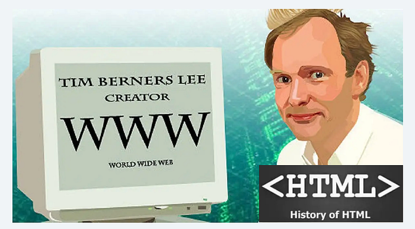
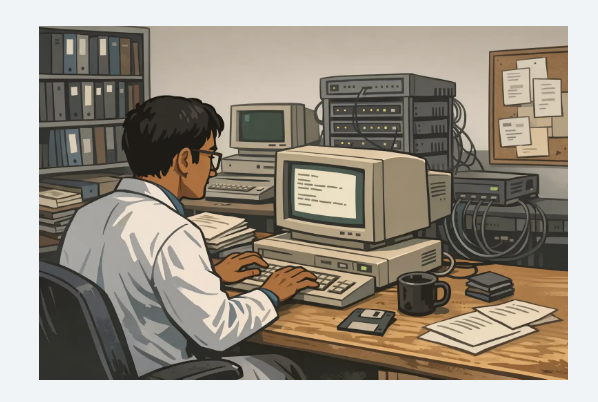
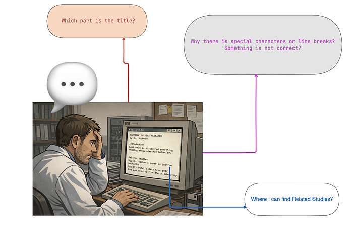
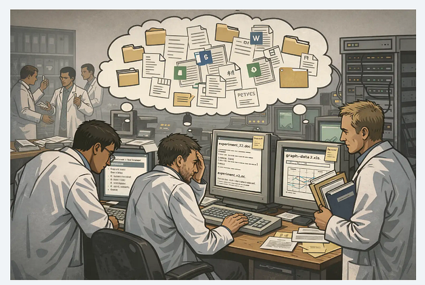
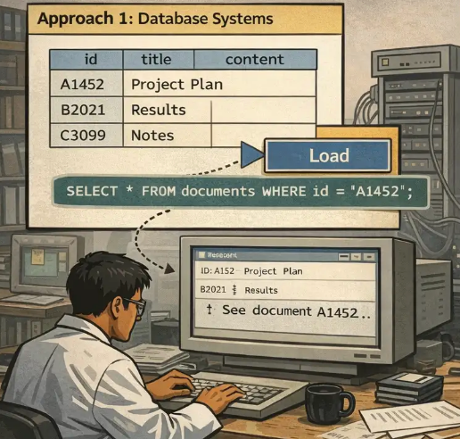
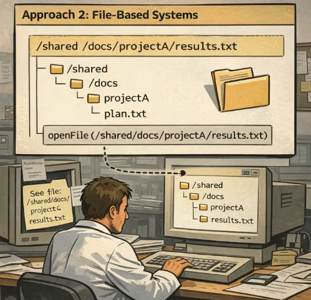
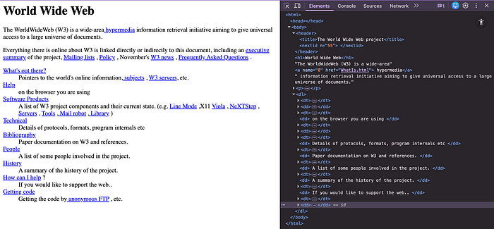

# Por que se inventou o HTML: a historia detrás da *world wide web*

## Algunha vez te preguntaches por que usamos HTML? Este é o simple problema que levou á súa invención e como creou a internet que usamos hoxe.



Moitos desenvolvedores escriben HTML todos os días, pero algunha vez te preguntaches por que se creou? Quen o construíu e que problema intentaban resolver? Exploremos a fascinante viaxe que levou á invención de HTML e da World Wide Web.

**NOTA:**

> As personaxes como **a doutora Shubham, a doutora David e a doutora Kishan** neste artigo son **exemplos ficticios**. Só empregarei estas personaxes para explicar os problemas reais aos que se enfrontaron os científicos na década de 1980.

A historia e os feitos reais son certos.

## O problema: compartir información nos primeiros días

Imaxina un científico en 1989. Chamémoslle **Dr. Shubham**, e digamos que traballa nun laboratorio de investigación.



**O Dr. Shubham** escribiu os resultados da súa investigación no seu ordenador e gardounos como arquivos de texto sinxelos. Naquel entón, os ordenadores funcionaban principalmente con **texto sen formato**:

- sen formato en negriñas
- sen títulos
- sen cores
- só texto sinxelo

**O Dr. Shubham** tamén dispón de acceso a algo chamado **rede informática**. Pero a rede primitiva non se parecía en nada ao que temos hoxe:

- sen Google (ou outras alternativas de busca)
- sen sitios web (sen ningún sitio web!)
- sen YouTube (nin vías de comunicación en liña)
- sen redes sociais (e moito menos smartphones, tablets,…)

**Que podería facer logo con esa infraestrutura tan limitada?**

- enviar correos electrónicos a outros científicos para colaborar, e
- transferir arquivos entre ordenadores

E iso era basicamente todo.

Un día, o **Dr. Shubham** rematou de escribir un importante artigo de investigación sobre física de partículas. Escribiuno no seu ordenador e tiña este aspecto:

```text
INVESTIGACIÓN EN FÍSICA DE PARTÍCULAS 
polo Dr. Shubham 

Introdución 
A semana pasada descubrimos algo sorprendente sobre o comportamento dos electróns ... 
Estudos relacionados Vexa o artigo do Dr. Kishan sobre mecánica cuántica Vexa os datos do Dr. Patel de 1987 Vexa os resultados do laboratorio dos Estados Unidos
```

Gardouno como `**research.txt 📑**`... en texto sinxelo sen formato.

Despois envioullo por correo electrónico ao seu colega en **Alemaña, o Dr. David.**
Unha hora despois, o **Dr. David** abriu o arquivo… e inmediatamente tivo problemas.



### Problema nº 1: Sen estrutura

Todo era texto sen formato. O Dr. David preguntouse a si mesmo:

- Cal era a parte do título?
- Cal era a parte da investigación propiamente dita?
- Onde remataba unha sección e onde comezaba outra?

Era confuso. Pero o Dr. David conseguiu descubrilo despois de ler con atención.

### Problema nº 2: Atopar documentos relacionados

O Dr. David atopou mencións de distintas investigacións:

- Un artigo do Dr. Kishan sobre mecánica cuántica
- Datos do ano 1987 do Dr. Patel 
- Resultados dun laboratorio estadounidense
- …

**Pero onde estaban estes papeis?**

O Dr. David mirou o seu ordenador. Tiña unha carpeta con máis 300 de arquivos de investigación:

```bash
- estudo_de_particulas_v2.txt 
- quantum_notas.txt 
- lab_results_final.txt 
- data_1987.txt
```

...e un bo montón de arquivos máis.

**Como ía atopar as referencias correctas?** Non podía abrir as citas do documento cun  `click` en calquera delas.

Entón, enviou un correo electrónico ao Dr. Shubham:

> ***Recibín o teu artigo, pero non atopo eses estudos relacionados que mencionas. Podes enviarme tamén eses arquivos?***

O Dr Shubham suspirou 😞!! Isto sucedía **con moita frecuencia** e tiña que:

1. Atopar 🔎 cada artigo que escribiron ***o Dr. Kishan\*** e ***o Dr. Patel\***
2. Axuntalos todos a un novo correo electrónico📧
3. Enviar todo de novo

**Levoulle horas compartir dita información. Algo que, visto dende agora, debería ter tomado minutos.**

### Problema nº 3: Problemas de compatibilidade

Ás veces, cando o Dr David abría un arquivo que lle enviaba o Dr Shubham, **os caracteres especiais**`**🀇 ง**` ou os saltos de liña **parecían incorrectos.**

Os distintos ordenadores empregaban estándares diferentes para mostrar o texto. O que aparecía correctamente no ordenador **do Dr. Shubham** podía parecer roto no ordenador **do Dr. David** .

**O Dr. Shubham** e **o Dr. David** non estaban sós. ***Miles de científicos, universidades e enxeñeiros\*** de todo o mundo enfrontábanse ás mesmas frustracións todos os días.

Pero non había unha boa maneira de compartir información estruturada e conectada. O coñecemento existía. Os ordenadores existían. As redes existían…

## ☀️ Coñecendo a Tim Berners-Lee: o home que o cambiou todo

É marzo de 1989 no [**CERN**](https://home.cern/) , a Organización Europea para a Investigación Nuclear, en Suíza, onde científicos de todo o mundo estudan física de partículas.

**Tim Berners-Lee**, un científico e programador informático británico, traballaba alí.

E como ***o Dr. Shubham,\*** enfrontábase aos mesmos problemas, e incluso a máis.

### O caos no CERN



No CERN, miles de científicos colaboraban en proxectos complexos. A xente estaba constantemente a:

- Unirse a novos proxectos
- Deixar proxectos antigos
- Crear novos documentos
- Actualizar proxectos antigos
- Referenciar o traballo dos demais

**O problema?**  

Toda esta información estaba esparexida por todas partes:

- En diferentes ordenadores
- En diferentes formatos
- En diferentes cartafoles
- Con diferentes versións

**Ninguén pode seguir a pista de todo.**

Antes da solución de Tim, diferentes equipos do CERN e doutros lugares intentaron varias estratexias. Vexamos o que intentaron:

### Enfoque 1: Sistemas de bases de datos

Algúns equipos comezaran a empregar distintos tipos de bases de datos internas para organizar documentos.



**Como funcionaban tecnicamente:**

1. O usuario fai clic nun botón
2. A aplicación executa algún código como:`SELECT * FROM documents WHERE id = 'A1452';`
3. A aplicación carga ese documento na interface de usuario

**A principal limitación:**

- A «ligazón» non estaba realmente no propio documento.
- Era unha instrución manexada polo código da aplicación.
- A conexión residía na lóxica do software, non no  documento.

### Enfoque 2: Sistemas baseados en arquivos

Outros equipos empregaron unidades compartidas e servidores internos, almacenando documentos como arquivos:



**A principal limitación:**

- A ruta só funcionaba nesa rede interna e só dentro dese software específico.
- Só para esa organización.
- Non existía un sistema de enderezos universal.

Había máis enfoques que podes buscar en liña para varios sistemas de xestión de documentos. Pero todos tiñan os mesmos problemas fundamentais.

## O verdadeiro problema

Para entender por que fallaron estas solucións, imaxinade este escenario:
**se alguén novo se unise a un proxecto no CERN, podería levar semanas só para comprendelo:**

- Onde se gardaban os documentos
- Cal foi a versión máis recente
- Que documentos estaban relacionados entre si
- Como navegar pola información

Tim Berners-Lee estaba frustrado porque:

- O coñecemento existía
- Existían algúns sistemas de enlace

Pero non existía **un sistema universal** para organizar e conectar a información **a nivel global.**

Sobre todas estas primeiras solucións: a `**linkining**` foi a única que funcionou:

- Dentro da rede desa empresa
- Usando ese software específico
- Con enderezos (rutas de arquivos, ID de bases de datos) que só tiñan sentido localmente

**Non había xeito de enlazar a un documento doutra universidade, noutro país, que usara un sistema diferente.**

Iso era o que a [**World Wide Web**](https://en.wikipedia.org/wiki/World_Wide_Web) necesitaba resolver.

## A gran idea de Tim: A proposta

En marzo de 1989, **Tim Berners-Lee** escribiu un documento titulado: [**Xestión da información: unha proposta**](https://cds.cern.ch/record/369245/files/dd-89-001.pdf)

Escribiuno para convencer ao **CERN** de que necesitaban unha mellor maneira de organizar e conectar a información.

A proposta basicamente dicía:

> **Temos demasiada información esparexida por todas partes e non hai unha boa maneira de xestionala. Que pasaría se construímos un sistema onde os documentos se puidesen conectar mediante ligazóns, para que a xente puidese explorar o coñecemento facilmente en lugar de buscar ás cegas?**

Describía unha idea revolucionaria:

- Os documentos poderían conter ligazóns a outros documentos
- Podes premer no texto para moverte entre a información relacionada
- O coñecemento estaría conectado, non disperso
- A xente nova podería comprender os proxectos máis rápido
- O sistema funcionaría globalmente, non só localmente

Estaba a propoñer unha mellor maneira de xestionar o coñecemento que non só estaba no CERN, senón potencialmente **en todas partes** .

Cando o xerente do **CERN** , daquela [**Mike Sendall** ,](https://www.w3.org/People/mike_sendall.html) recibiu a proposta, aínda non entendía completamente como funcionaría. Era unha gran idea. Unha idea nova. Unha idea pouco común.

Así que lle respondeu a Tim cun comentario que se faría famoso:

> [***Vago, pero emocionante.\***](https://physicsworld.com/a/vague-but-exciting-how-the-web-transformed-business/)

O que basicamente significaba: ***aínda non estou totalmente seguro de como funcionará isto, pero parece interesante e prometedor.\***

**Isto non foi un rexeitamento!**

**Mike Sendall** estaba realmente interesado e deulle permiso **a Tim** para traballar no proxecto. Ese famoso comentario agora é coñecido na historia da tecnoloxía porque demostra como mesmo as ideas revolucionarias poden parecer pouco claras ao principio.

## ✨ Da idea á realidade

Unha vez aceptada a proposta, Tim enfrontouse a un reto maior:

Para converter a idea da Web en realidade, decatouse de que necesitaba inventar **tres cousas básicas:**

1. **Un xeito de estruturar documentos** → Para que os ordenadores poidan entender que é un título, que é unha ligazón, que é un parágrafo
2. **Un xeito de transferir documentos entre ordenadores** → Para que a xente puidese solicitar e recibir documentos a través da rede
3. **Un xeito de identificar documentos de forma única a nivel mundial** → Así, cada documento do mundo podería ter un enderezo único

Foi entón cando creou os tres piares da **World Wide Web** :

1. [**HTML**](https://en.wikipedia.org/wiki/HTML) (Linguaxe de marcado de hipertexto) → para estruturar documentos
2. [**HTTP**](https://en.wikipedia.org/wiki/HTTP) (Protocolo de transferencia de hipertexto) → para transferir documentos
3. [**URL**](https://en.wikipedia.org/wiki/URL) (Localizadores Uniformes de Recursos) → para identificar documentos

**Si** , estes tres foron creados para resolver un problema principal: ***a conexión global e a facilidade para compartir información.\***

## O primeiro sitio web

O **6 de agosto de 1991** , **Tim Berners-Lee** publicou o primeiro sitio web do mundo. Estaba aloxado no **CERN** e explicaba o que era a World Wide Web.

**O enderezo era:** `http://info.cern.ch/hypertext/WWW/TheProject.html` [Enderezo principal: `http://info.cern.ch/`[)](http://info.cern.ch/))

Así era



Era sinxelo. Moi sinxelo. Pero era **revolucionario**.
Por primeira vez na historia:

- A información estaba estruturada dun xeito estándar que todos os ordenadores podían comprender
- Os documentos poderían enlazar con outros documentos cun simple clic
- Calquera persoa cun ordenador e conexión a internet podería acceder a ela
- Funcionou do mesmo xeito en todo o mundo

## Os tres inventos traballando xuntos

Vexamos como funcionan as tres pezas como un sistema:

### 1. HTML (linguaxe de marcado de hipertexto)

- Estrutura o documento con etiquetas
- Fai que o contido sexa lexible e se poida facer clic nel
- Dá significado a diferentes partes (títulos, parágrafos, ligazóns)
- Linguaxe universal que todos os navegadores entenden

### 2. HTTP (Protocolo de transferencia de hipertexto)

- Transfire documentos a través de Internet
- Como un sistema de entrega para páxinas web
- Define como responden as páxinas de solicitude dos navegadores e os servidores
- Garante unha entrega segura e fiable

### 3. URL (Localizador uniforme de recursos)

- Enderezo único para cada documento na web
- Funciona globalmente, non só localmente, por exemplo:`http://example.com/page.html`
- Permitiu consultar calquera documento en calquera lugar

**Xuntos, estes tres inventos crearon o que hoxe chamamos a World Wide Web.**

## Por que se chama HTML?

Analicemos o nome para entender o que realmente estás aprendendo:

```
**HTML = HyperText Markup Language**
```

### Hipertexto:

- **Hiper** = máis alá, máis do normal
- **Texto** = palabras escritas
- **Hipertexto** = texto que pode enlazar con outro texto (non lineal, interconectado)

**Pensa nun libro:** les a páxina 1, despois a páxina 2 e despois a páxina 3 coma se fose unha estrada recta, pero o hipertexto permíteche saltar da páxina 1 á páxina 50 e á páxina 12 grazas ás ligazóns!

**Marcado**: significa engadir etiquetas ou notas para identificar diferentes partes. Como un profesor que marca diferentes seccións dun ensaio.

**Linguaxe**: Un conxunto de regras que os ordenadores poden ler e comprender. Do mesmo xeito que o inglés ten regras gramaticais, a HTML ten as súas propias regras.

**Por iso se chama HTML!**

- **Hiper** = Pode saltar dun lado para outro (non só ler de principio a fin)
- **Texto** = Palabras e contido
- **Marcado** = Etiquetas que explican o que é cada parte
- **Linguaxe** = Regras lexibles para o ordenador

## Como HTML resolveu o problema

Lembras aquel artigo de investigación que escribiu o Dr Shubham? Con HTML, tería un aspecto completamente diferente:

```html
<html> 
<head> 
  <title> Investigación en Física de Partículas </ title > 
</head> 
<body> 
  <h1> INVESTIGACIÓN EN FÍSICA DE PARTÍCULAS </h1> 
  <p> polo Dr. Shubham </p> 
  
  <h2> Introdución </h2> 
  <p> A semana pasada descubrimos algo sorprendente sobre o comportamento dos electróns. </p> 
  
  <h2> Estudos relacionados </h2> 
  <ul> 
    <li> Vexa <a href="http://cern.ch/papers/kishan-quantum.html"> o artigo do Dr. Kishan sobre mecánica cuántica </a> </li> 
    <li> Vexa <a href = "http://cern.ch/papers/patel-1987.html"> os datos do Dr. Patel de 1987 </a> </ li > 
    <li> Vexa <a href = "http://uslabs.gov/results/particles.html"> os resultados do laboratorio dos Estados Unidos </a> </li> 
  </ul> 
</body> 
</html>
```

### ✅ Problema 1: A estrutura non estaba clara

**Antes:** Todo era texto sen formato. Non se podía distinguir o que era un título, o que era un encabezado ou o que era texto normal.

**Despois:** as etiquetas HTML como `<h1>`, `<h2>`, `<p>` déronlle estrutura e significado ao contido. Agora o ordenador do Dr. David podía mostrar o título máis grande, os encabezados en negra e os parágrafos co formato correcto, e de xeito automático!

### ✅ Problema 2: Atopar documentos relacionados

**Antes:** o Dr. David tivo que buscar manualmente entre 300 arquivos para atopar o "artigo do Dr. Kishan sobre mecánica cuántica".

**Despois:** Simplemente fixo clic no texto subliñado en azul (a ligazón `<a>`) e, ao instante, abriuse o artigo do Dr. Kishan. Sen buscar. Sen enviar e ver correos electrónicos. Sen esperar.

### ✅ Problema 3: Os documentos tiñan un aspecto diferente en diferentes ordenadores

**Antes:** Os problemas de codificación de texto e os diferentes estándares facían que os documentos tivesen un aspecto inconsistente.

**Despois:** HTML era un estándar universal. Calquera ordenador que entendese HTML o mostraba do mesmo xeito. A estrutura conservouse.

### ✅ Problema 4: Non hai xeito de compartir ligazóns globalmente

**Antes:** As rutas de arquivos como `/shared/docs/projectA/results.txt` só funcionaban en redes locais.

**Despois:** as URL como `http://cern.ch/papers/kishan-quantum.html` funcionaban **globalmente**. Calquera persoa, en calquera lugar do mundo, cunha conexión a Internet, podía acceder ao mesmo documento usando o mesmo enderezo.

Isto foi revolucionario.

## Por que é importante comprender esta historia

Cando aprendes HTML, é doado simplemente memorizar:

- `<h1>`→ fai títulos grandes
- `<p>`→ fai parágrafos
- `<a>`→ crea ligazóns

Pero cando entendes o **porqué** detrás do HTML, todo cobra máis sentido:

### 1. As etiquetas existen para darlle significado ao contido

As etiquetas HTML non só se tratan de estilo, senón tamén de **semántica** para dar significado e estrutura para que tanto os humanos como os ordenadores poidan comprender o contido.

Unha etiqueta `<h1>` non só agranda o texto, senón que tamén di que **este é o título principal deste documento.**

### 2. Inventáronse ligazóns para conectar coñecementos en todo o mundo

A etiqueta `<a>` (áncora) cambiou as regras do xogo porque conectaba documentos a través de:

- Diferentes ordenadores
- Diferentes organizacións
- Diferentes países

Creou unha rede de coñecemento interconectado.

### 3. O HTML foi deseñado para ser sinxelo, de xeito que todos o puidesen usar

Tim podería ter feito o HTML complexo e potente desde o principio. En vez diso, fíxoo o **suficientemente sinxelo como para que calquera puidese aprendelo** e crear páxinas web.

Esa simplicidade é a razón pola que a Web creceu tan rápido.

Inicialmente, a versión básica de HTML foi inventada por **Tim Berners-Lee** para resolver o problema da **vinculación global e o intercambio de información** .

Máis tarde, a medida que a Web se popularizou, o HTML continuou a evolucionar. Organizacións como o [**W3C (World Wide Web Consortium)**](https://en.wikipedia.org/wiki/World_Wide_Web_Consortium) e desenvolvedores de todo o mundo engadiron novas características e estándares para facer que o HTML fose máis potente.

O HTML non só creou sitios web. **Creou as bases de todo o mundo dixital no que vivimos hoxe.**

### Que é o seguinte para ti?

Agora que xa entendes o que é HTML e por que se creou, estás listo para:

1. **Aprende máis sobre as etiquetas HTML** e como usalas de forma eficaz
2. **Crea as túas propias páxinas web** e compárteas co mundo
3. **Entender como funcionan os sitios web modernos** (aínda están construídos en HTML!)
4. **Únete aos miles de millóns de persoas** que usaron o invento de Tim para compartir coñecemento

---

*Tradución aproximada do artigo de [Rajesh Kumar](https://rky211.medium.com/?source=post_page---byline--8faa55883708---------------------------------------) publicado en [Medium](https://rky211.medium.com/why-html-was-invented-the-real-story-behind-the-web-8faa55883708) o 28 de xaneiro de 2026*