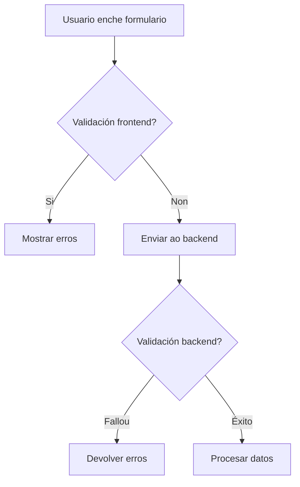
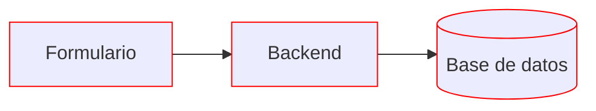
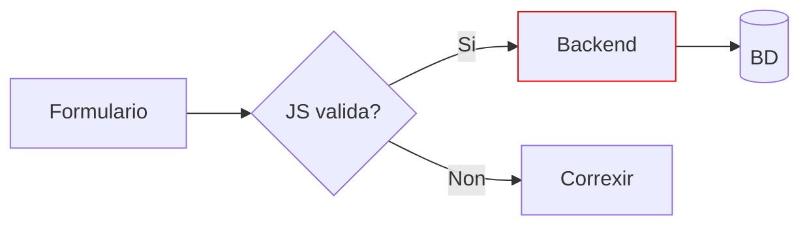
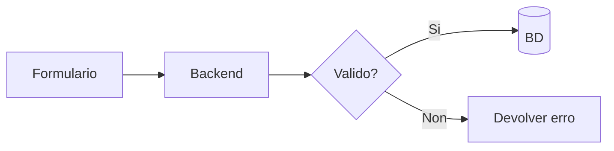
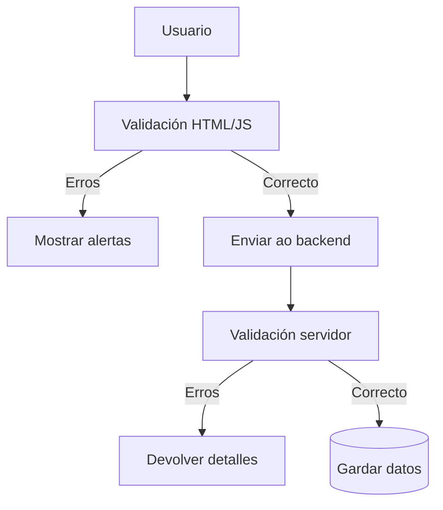

## Validacións de formularios

Ao crear formularios en HTML, é fundamental anticiparse a erros mediante **sistemas de validación** que aseguren que os datos recibidos son correctos e seguros.

### Que é unha validación?

A validación é un proceso automático que comproba se a información introducida cumpre certos requisitos. Existen dous tipos principais:

1. **Validación no cliente (frontend):**  
   Realízase no navegador antes de enviar datos
2. **Validación no servidor (backend):**  
   Execútase no servidor tras recibir os datos



### Escenarios de validación

#### 1. Sen validación

**Riscos:**  
- Datos incorrectos ou maliciosos  
- Corrupción de bases de datos  
- Vulnerabilidades de seguridade  

#### 2. Validación só en frontend

**Problemas:**  
- Validación pode desactivarse  
- Sen comprobación final no servidor  

#### 3. Validación só en backend

**Desvantaxes:**  
- Maior latencia  
- Posible perda de datos ao corrixir  

#### 4. Dobre validación (recomendado)


### Boas prácticas

1. **Validación HTML5:**  
   ```html
   <input type="email" required minlength="5" pattern="[a-z0-9]+@dominio\.gal">
   ```

2. **Validación con JavaScript:**  
   ```javascript
   document.querySelector('form').addEventListener('submit', (e) => {
     const input = document.getElementById('usuario');
     if (!input.checkValidity()) {
       e.preventDefault();
       mostrarErro('Nome de usuario inválido');
     }
   });
   ```

3. **Validación no servidor (exemplo en Node.js):**  
   ```javascript
   app.post('/rexistro', (req, res) => {
     const { email } = req.body;
     if (!validarEmail(email)) {
       return res.status(400).json({ erro: 'Email inválido' });
     }
     // Gardar en BD...
   });
   ```

### Recursos recomendados

- [Validación de formularios - MDN](https://developer.mozilla.org/gl/docs/Learn/Forms/Form_validation)
- [Express Validator](https://express-validator.github.io/docs/) (Middleware para Node.js)
- [Client-Side Form Handling](https://web.dev/learn/forms/)

---

**Conclusión clave:**  
A combinación de validacións en frontend (para experiencia de usuario) e backend (para seguridade) ofrece a mellor protección contra erros e ataques.

---

DAW🧊2025