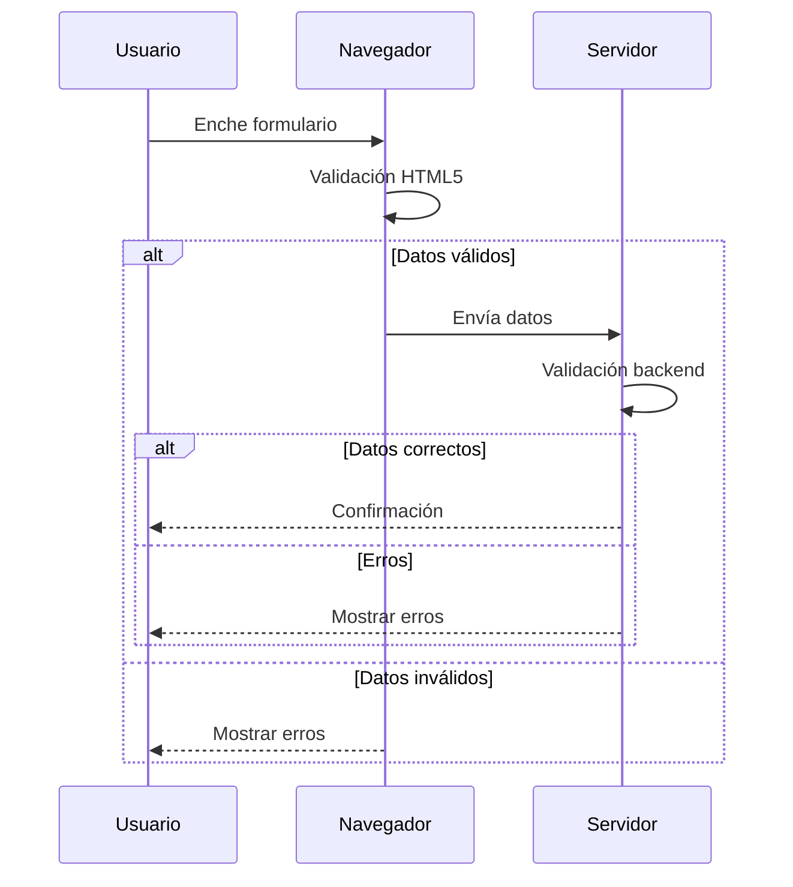

## Validacións básicas con HTML5

HTML5 ofrece un conxunto de atributos integrados para validación de formularios, permitindo comprobacións básicas sen necesidade de JavaScript. Vexamos os principais:

### Atributos clave de validación

| Atributo      | Aplicación                   | Función                                                                 |
|---------------|------------------------------|-------------------------------------------------------------------------|
| `maxlength`   | Campos de texto              | Limita o número máximo de caracteres                                   |
| `minlength`   | Campos de texto              | Establece a lonxitude mínima requirida                                 |
| `min`         | Números, datas               | Define o valor mínimo permitido                                       |
| `max`         | Números, datas               | Define o valor máximo permitido                                       |
| `step`        | Números, datas               | Controla os incrementos permitidos                                    |
| `required`    | Todos os campos              | Marca un campo como obrigatorio                                       |
| `pattern`     | Campos de texto              | Valida contra unha expresión regular                                  |

### Exemplo práctico

```html
<form id="rexistro" novalidate>
  <!-- Campo de usuario -->
  <div class="campo">
    <label for="usuario">Nome de usuario*:</label>
    <input type="text" 
           id="usuario" 
           name="usuario"
           required
           minlength="5"
           maxlength="20"
           pattern="[A-Za-z0-9]+"
           title="Só letras e números (5-20 caracteres)">
    <span class="axuda">Exemplo: usuario123</span>
  </div>

  <!-- Campo de data -->
  <div class="campo">
    <label for="nacemento">Data de nacemento*:</label>
    <input type="date" 
           id="nacemento"
           name="nacemento"
           required
           min="1920-01-01"
           max="2024-12-31">
  </div>

  <button type="submit">Rexistrarse</button>
</form>
```

### Estilización de estados

```css
/* Estilos base */
.campo {
  margin-bottom: 1.5rem;
}

input {
  padding: 0.8rem;
  border: 2px solid #ddd;
  border-radius: 4px;
  width: 100%;
  transition: all 0.3s ease;
}

/* Estado válido */
input:valid {
  border-color: #4CAF50;
  background: url('check-icon.svg') no-repeat right 10px center;
}

/* Estado inválido */
input:invalid {
  border-color: #f44336;
  background: url('warning-icon.svg') no-repeat right 10px center;
}

/* Mensaxes de erro */
.axuda {
  display: block;
  font-size: 0.875rem;
  color: #666;
  margin-top: 0.5rem;
}

input:invalid + .axuda {
  color: #f44336;
}
```

### Fluxo de validación



### Diferenzas entre `disabled` e `readonly`

| Característica          | `disabled`                  | `readonly`                  |
|-------------------------|-----------------------------|-----------------------------|
| **Envío de datos**      | Non se inclúe               | Inclúese                    |
| **Apariencia**          | Griseado                    | Normal                      |
| **Interacción**         | Non editable                | Non editable                |
| **Foco**                | Non aplicable               | Permite foco                |

### Recursos adicionais

1. [Guía completa de validacións en MDN](https://developer.mozilla.org/gl/docs/Learn/Forms/Form_validation)
2. [Expresións regulares útiles](https://regexlib.com/)
3. [Boas prácticas de deseño de formularios](https://www.nngroup.com/articles/web-form-design/)

---

**Consellos importantes:**
- Combinar sempre con validación no servidor
- Usar mensaxes de erro descriptivas
- Probar en múltiples navegadores
- Garantir accesibilidade con etiquetas apropiadas

Este enfoque simple ofrece unha base sólida para crear formularios robustos e accesibles. Facelos medrar xa é cousa túa!

:tada:

---

DAW🧊2025