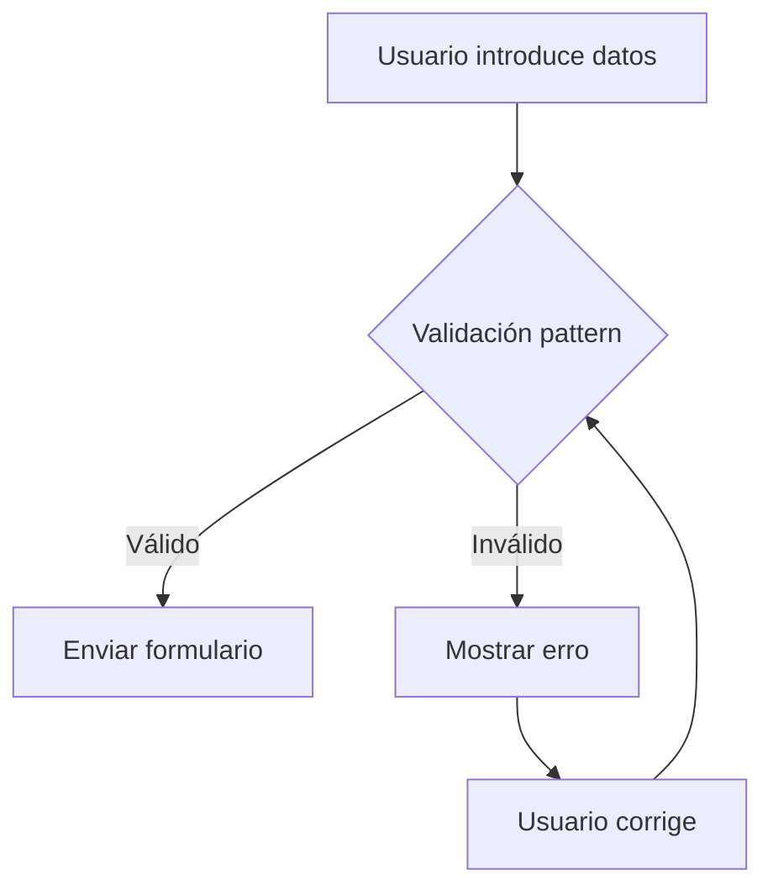

## O atributo `pattern` (expresións regulares)

Aínda que os atributos básicos de validación HTML5 son ben potentes para moitos usos de validación, en algúns casos poden resultar insuficientes. O atributo `pattern` permítenos usar **expresións regulares** (*RegExp.*) para validacións avanzadas en campos de texto.

### Funcionamento básico

```html
<form method="post" action="/enviar">
  <!-- Campo para código postal galego -->
  <label for="cp">Código Postal:</label>
  <input type="text" 
         id="cp" 
         name="codigo_postal"
         pattern="^15[1-9]{3}$"
         title="Exemplo: 15701 (Santiago)"
         required>
</form>
```

**Explicación do patrón:**
- `^15`: Debe comezar con 15 (Galicia)
- `[1-9]{3}$`: Seguido de 3 díxitos entre 1-9
- Exemplos válidos: 15701, 15999

### Exemplos de expresións regulares útiles

| Caso de uso          | Patrón Regex               | Exemplo válido      |
|----------------------|---------------------------|---------------------|
| DNI español          | `^\d{8}[A-HJ-NP-TV-Z]$`   | 12345678Z          |
| IBAN español         | `^ES\d{22}$`              | ES9121000418450200051332 |
| Teléfono móbil galego| `^[6|7]\d{8}$`           | 688123456          |
| Email institucional  | `^[a-z.]+@(xunta|edu)\.gal$` | xoan.perez@xunta.gal |

### Estilización de erros

```css
input:invalid {
  border: 2px solid #ff4444;
  background: #ffebee url('icona-erro.svg') no-repeat right 10px center;
}

input:invalid + .axuda {
  display: block;
  color: #ff4444;
}
```

### Ferramentas recomendadas

1. [RegExr](https://regexr.com/) - Probador interactivo com explicacións
2. [Regex101](https://regex101.com/) - Validador com soporte para múltiples dialectos
3. [Regex Vis](https://regex-vis.com/) - Xerador de diagramas de expresións regulares



### Boas prácticas

- **Mensaxes claras:** Usa o atributo `title` para explicar o formato requirido
- **Compatibilidade:** Verifica os navegadores obxectivo ([Can I use](https://caniuse.com/?search=pattern))
- **Seguridade:** Combinar sempre com validación no servidor
- **Accesibilidade:** Asocia mensaxes de erro com `aria-describedby`

**Recursos adicionais:**
- [Guía MDN sobre validación com pattern](https://developer.mozilla.org/gl/docs/Web/HTML/Attributes/pattern)
- [Expresións regulares en JavaScript](https://developer.mozilla.org/gl/docs/Web/JavaScript/Guide/Regular_Expressions)
- [Xerador de Regex para enderezos galegos](https://regex.gal/)
- [lenguajehtml.com - Formularios](https://lenguajehtml.com/html/formularios/etiqueta-html-form/)

---

:tada:

---

DAW🧊2025